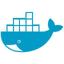

<h1 align="center">Hola 👋, Me llamo Franco! </h1>
<h3 align="center">Soy un Programador Backend de Tucumán - Argentina</h3>

- 🔭 Actualmente me encuentro profundizando en **NestJS**

- 🌱 Tengo sólidos conocimientos en **NodeJS - Typescript**

- 👯 He participado de proyectos colaborativos bajo la modalidad SCRUM en **No Country & InstitutoWeb**

- ⚡ Tengo experiencia aplicando: **Clean Architecture - Design Patterns - Principios S.O.L.I.D.**

<h3 align="center">Connect with me:</h3>

<h3 align="center">Languages and Tools:</h3>

 
  
    
      
  
  
        
          
    
    
  
    
  
      

 
 

  
  

---

Template Credit to:
[BrantLauro](https://github.com/BrantLauro)
